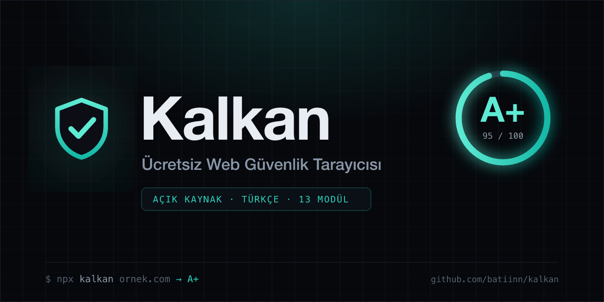

<div align="center">



# 🛡 Kalkan

**Açık kaynak, Türkçe web güvenlik tarayıcısı**

Bir alan adı girin; SSL'den e-posta korumasına, açıkta kalan dosyalardan açık portlara kadar **13 modülde** saniyeler içinde puanlı bir güvenlik raporu alın. Kayıt yok, sınır yok, tamamen ücretsiz.

[Web Arayüzü](#-web-arayüzü) · [CLI](#-cli-komut-satırı) · [Modüller](#-tarama-modülleri) · [GitHub Action / CI](#-github-action--ci) · [Rozet & PDF](#-rozet--pdf-rapor) · [Kütüphane Olarak](#-kütüphane-olarak)

</div>

---

## Neden Kalkan?

Yurtdışında SSL kontrolü, güvenlik header analizi, DMARC denetimi ve dosya sızıntısı taraması genellikle **ayrı ayrı ücretli** araçlar gerektirir. Kalkan bunların hepsini **tek raporda, Türkçe ve ücretsiz** toplar:

- 🇹🇷 **Tamamen Türkçe** — her bulgu, açıklaması ve düzeltme önerisiyle birlikte.
- 📊 **Puanlı rapor** — 0-100 genel puan + A+…F harf notu, modül bazında kırılım.
- ⚡ **Canlı akış** — modüller bittikçe sonuçlar anında görünür.
- 🔒 **Pasif analiz** — hedefe saldırmaz, zarar vermez; yalnızca dışarıdan gözlemler.
- 🧩 **Açık kaynak çekirdek** — CLI, kütüphane veya web arayüzü olarak kullanın.

## 🌐 Web Arayüzü

```bash
npm install
npm run dev
# http://localhost:3000
```

Premium, karanlık temalı arayüzde alan adını yazın ve **Ücretsiz Tara**'ya basın.

## ⌨️ CLI (Komut Satırı)

Kurulum gerektirmeden çalıştırın:

```bash
npm run cli ornek.com
npm run cli ornek.com -- --json   # makine-okunur çıktı
```

Yapıyı derleyip global komut olarak da kullanabilirsiniz:

```bash
npm run build:cli
node dist/cli.js ornek.com
```

## 🔍 Tarama Modülleri

| Modül | Ne kontrol eder |
|-------|-----------------|
| **SSL/TLS** | Sertifika geçerliliği, bitiş süresi, TLS sürümü, self-signed tespiti |
| **HTTPS Yönlendirmesi** | HTTP→HTTPS zorlaması, şifresiz servis riski |
| **Güvenlik Header'ları** | HSTS, CSP, X-Frame-Options, X-Content-Type-Options, Referrer/Permissions-Policy, sızdırılan sunucu bilgisi |
| **Çerez Güvenliği** | Secure, HttpOnly, SameSite bayrakları |
| **Açıkta Kalan Dosyalar** | `.env`, `.git`, yedekler, `phpinfo`, `server-status` (içerik doğrulamalı) |
| **Açık Port Taraması** | FTP, Telnet, RDP ve internete açık veritabanları (MySQL, Redis, MongoDB, Elasticsearch) |
| **E-posta Güvenliği** | SPF, DMARC politikası, DKIM varlığı (spoofing koruması) |
| **CORS Yapılandırması** | Keyfi origin yansıtma + `Allow-Credentials` yanlış yapılandırması |
| **Karışık İçerik** | HTTPS sayfada şifresiz (HTTP) yüklenen kaynaklar |
| **WordPress Güvenliği** | Kullanıcı adı listeleme, XML-RPC, sürüm ifşası, açık giriş sayfası |
| **DNS** | A/AAAA, MX, NS, CAA kayıtları ve yapılandırma sağlığı |
| **Subdomain Keşfi** | Sertifika şeffaflık günlüklerinden (crt.sh) pasif keşif; riskli ortam tespiti |
| **Teknoloji Parmak İzi** | CMS/sunucu/framework tespiti ve açık sürüm uyarısı |

## 🤖 GitHub Action / CI

Reponuza ekleyin; her push'ta sitenizi tarayıp güvenlik puanı eşiğin altına düşerse build'i kırmızıya çevirsin:

```yaml
# .github/workflows/security.yml
name: Güvenlik Taraması
on: [push]
jobs:
  kalkan:
    runs-on: ubuntu-latest
    steps:
      - uses: batiinn/kalkan@main
        with:
          url: ornek.com
          fail-under: "70"   # puan < 70 ise başarısız
          fail-on: high      # kritik/yüksek bulgu varsa başarısız
```

CLI'da aynı eşik kontrolü (herhangi bir CI'da çalışır):

```bash
npx kalkan ornek.com --fail-under 70 --fail-on high
echo $?   # eşik aşıldıysa 1, geçtiyse 0
```

## 🏅 Rozet & PDF Rapor

- **PDF rapor:** Tarama sonrası **PDF olarak indir** ile tüm bulguları içeren, müşteriye teslim edilebilir profesyonel bir rapor üretin.
- **Paylaşılabilir link:** Her tarama `?url=...` permalink'iyle paylaşılabilir; link açıldığında otomatik yeniden taranır.
- **Rozet:** Sitenizin altına ekleyebileceğiniz canlı güvenlik rozeti:

```markdown
[](https://SUNUCUNUZ/?url=ornek.com)
```

## 📦 Kütüphane Olarak

Tarama motoru framework'ten bağımsızdır:

```ts
import { scan, scanStream } from "./src/scanner";

// Tek seferde tam rapor
const report = await scan("ornek.com");
console.log(report.overallScore, report.grade);

// Modüller bittikçe akış halinde
for await (const event of scanStream("ornek.com")) {
  if (event.type === "module") console.log(event.result.id, event.result.score);
}
```

## 🏗 Teknoloji

Next.js 15 · React 19 · TypeScript · Tailwind CSS v4 · sıfır dış tarama bağımlılığı (yalnızca Node yerleşik `tls`/`dns`/`fetch`).

## ⚖️ Etik & Yasal

Kalkan yalnızca **pasif/dışarıdan** analiz yapar (sertifika, header, DNS, herkese açık dosya yolları). Saldırı, brute-force veya istismar içermez. Yine de yalnızca **sahibi olduğunuz veya tarama izniniz olan** siteleri tarayın. Yerel ve özel ağ adresleri (SSRF koruması) bilinçli olarak engellenir.

## 📄 Lisans

MIT — özgürce kullanın, değiştirin, dağıtın.
